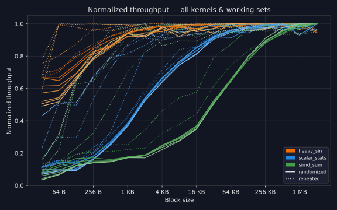
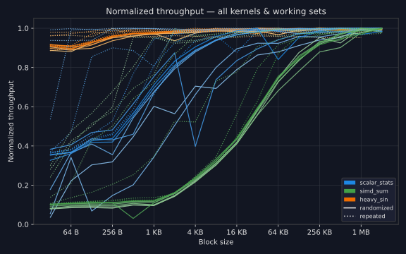

# Benchmark: How Much Linear Memory Access Is Needed?

A small benchmark exploring how memory access patterns affect throughput. It processes a fixed amount of data split into blocks of varying sizes, measuring MB/s for each block size. 

For small block sizes, several overheads occur: the prefetcher is not as effective, the branch predictor has to work harder, TLB prefetching and caching suffers.

We run three types of kernels:
* `simd_sum` - a raw AVX2/NEON sum over the data. This reaches 50+ GB/s on some systems.
* `scalar_stats` - simple computation but mostly scalar and a little branchy. Reaches ~5-10 GB/s.
* `heavy_sin` - a dependent `sin(x)` for each value. Reaches ~400 MB/s.

A single run processes a fixed working set size (e.g. 64 MB total) split into blocks of linear memory (all the same size but randomized over a large block of backing memory, 4GB by default).
Blocks vary from 32 B to 2 MB, always aligned to 32 B for SIMD.
A kernel thus takes a `span<span<float const> const> data`.

A single run executed the kernel over the working set.
We execute multiple runs with the same setting and report the median.
This reduces impact of outliers above (e.g. scheduling hiccups) and below (prefetcher and predictors being right "by accident").

We test "randomized" and "repeated".
For randomized, we clobber the cache before each run and each run also has a new randomized block layout.
This is a kind of worst case where the cache hierarchy is irrelevant: caches completely cold and no data is touched twice.
"repeated" only clobbers at the start of each set of runs with the same parameters and also doesn't randomize blocks in between.
As we report the median, this means the cache hierarchy can be filled in the first run and subsequent ones benefit from partially warm data.

In summary, the important parameters are:
* `working_set_bytes`: total data processed per run, tested from 1 MB to 64 MB.
* `backing_bytes`: large memory pool blocks are drawn from, fixed at 4 GB to ensure blocks are always cold relative to the working set.
* `randomized` vs `repeated`: randomized clobbers the cache and picks a fresh block layout before each run, repeated only clobbers once and reuses the same layout so the cache can warm up across runs.
* `block_bytes`: size of each contiguous memory block, swept from 32 B to 2 MB in powers of two, always aligned to 32 B for SIMD.
* `kernel`: computation performed over the blocks, one of `simd_sum` (AVX2/NEON sum), `scalar_stats` (branchy scalar), or `heavy_sin` (dependent sin chain).


## Requirements

- [CMake](https://cmake.org/) >= 3.25
- A C++23 compiler: GCC 14+, Clang 17+, or MSVC 19.38+ (VS 2022 17.8+)
- Python 3.11+
- [uv](https://github.com/astral-sh/uv) *(optional, for the shortcut scripts)*

## Quickstart

```bash
# Build and run with uv (recommended)
uv run run.py

# Build only
uv run build.py
```

## Manual steps

```bash
# Configure
cmake -B build

# Build
cmake --build build --config Release

# Run
./build/bin/bench-linear-access       # Linux / macOS
build\bin\Release\bench-linear-access.exe     # Windows
```

## Results

### Ryzen 9 7950X3D



### MacBook Air M4


